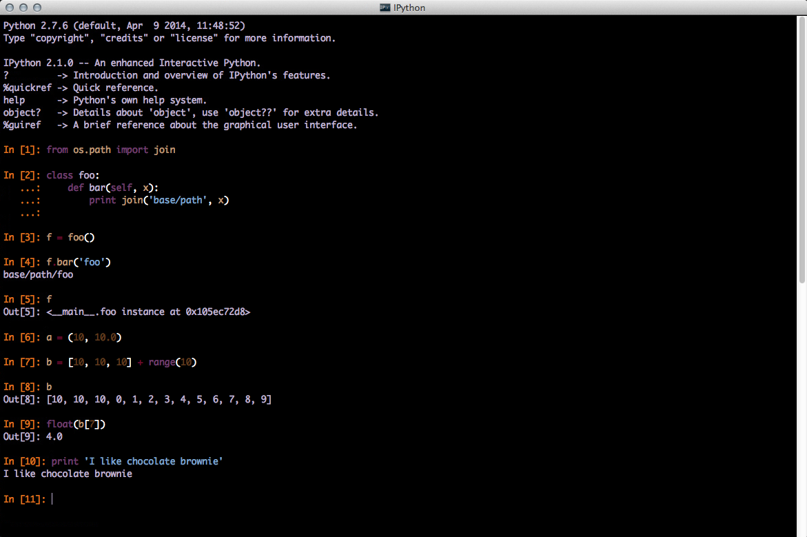

ChocolateBrownie
================

IPython pygment style and stylesheet.

##Installation

Install [pygments](http://pygments.org/) if required

```pip install pygments```

Look for the source folder of pygments by entering the following in IPython:

```import pygments```

```pygments.__file__```

```Here is a sample output

>'/usr/lib/python2.7/dist-packages/pygments/__init__.pyc'


Copy _chocolatebrownie.py_ to 

>\<pygments_dir\>/styles/ 


Now you can give it a test run by running:

```ipython qtconsole --stylesheet=\<ChocolateBrownie_path\>/css/chocolatebrownie.css --style=chocolatebrownie```

To make _chocolatebrownie_ your default qtconsole style you need to configure a profile. Start by running the following command to create a profile if there isn't one:

```ipython profile create```

This should create several configuration files. In the qtconsole configuration file

> _~/.ipython/profile_default/ipython_qtconsole_config.py_

...set the following parameters as shown below:

```c.IPythonWidget.syntax_style = u'chocolatebrownie'```

```c.IPythonQtConsoleApp.stylesheet = '<path to chocolatebrownie.css>'```

##Screenshot



##Colors
Names and HEX codes from [http://www.colourlovers.com/](http://www.colourlovers.com/)


##TODO
Add error and stack trace highlighting.
